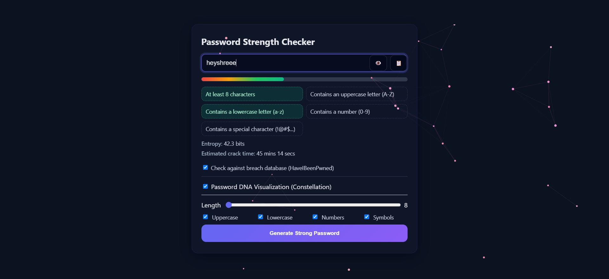

# Password Strength Checker

Live demo: https://heyshreee.github.io/password-strength-checker/

## Features
- **Real-time strength meter** with criteria checklist
- **Entropy** and **estimated crack time**
- **Copy** and **generate** password buttons with options
- Optional **breach check** using HaveIBeenPwned (k-anonymity, no plaintext sent)
- **Password DNA** Constellation visualization as a background (dark theme)
- Responsive, accessible UI

## Usage
Open `index.html` in a modern browser. Start typing a password to see:
- Strength meter and checklist updates
- Entropy/crack-time estimates
- Background visualization change based on the password pattern

Use the generator controls to create strong passwords, and the clipboard button to copy.

## Local Development
1. Clone or download this repo.
2. Open `password-strength-checker/index.html` in your browser.
3. Edit `style.css` and `script.js` to customize behavior and styles.

## Privacy Notes
- Breach checks use HaveIBeenPwned’s range API: only the first 5 SHA-1 characters are sent. No plaintext passwords leave your device.
- Visualization and scoring are computed locally in your browser.

## Screenshot
- Replace `assets/screenshot.png` with your own screenshot if desired.